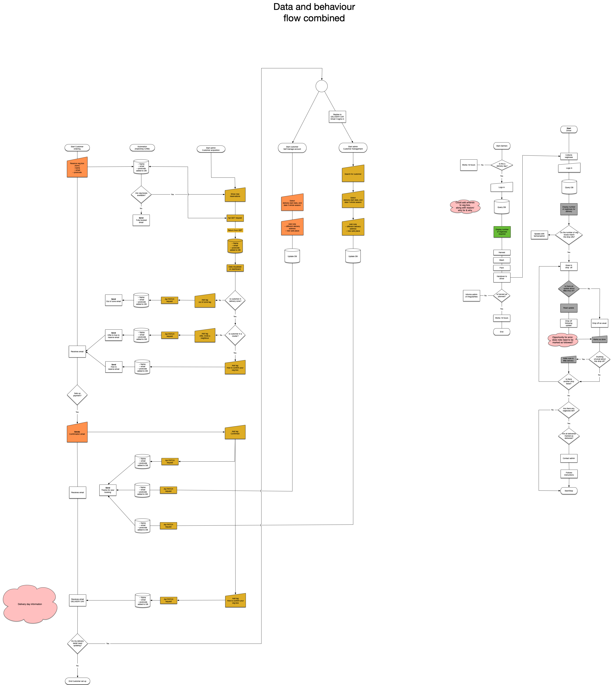
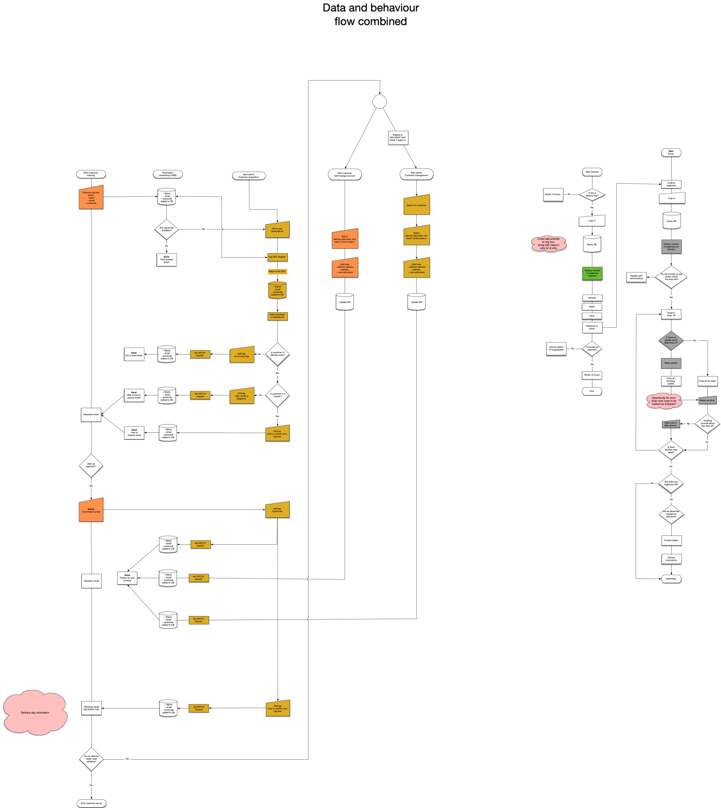
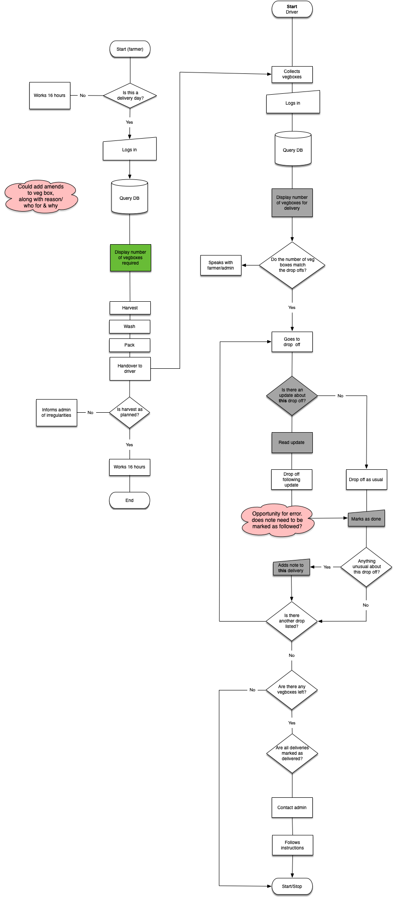
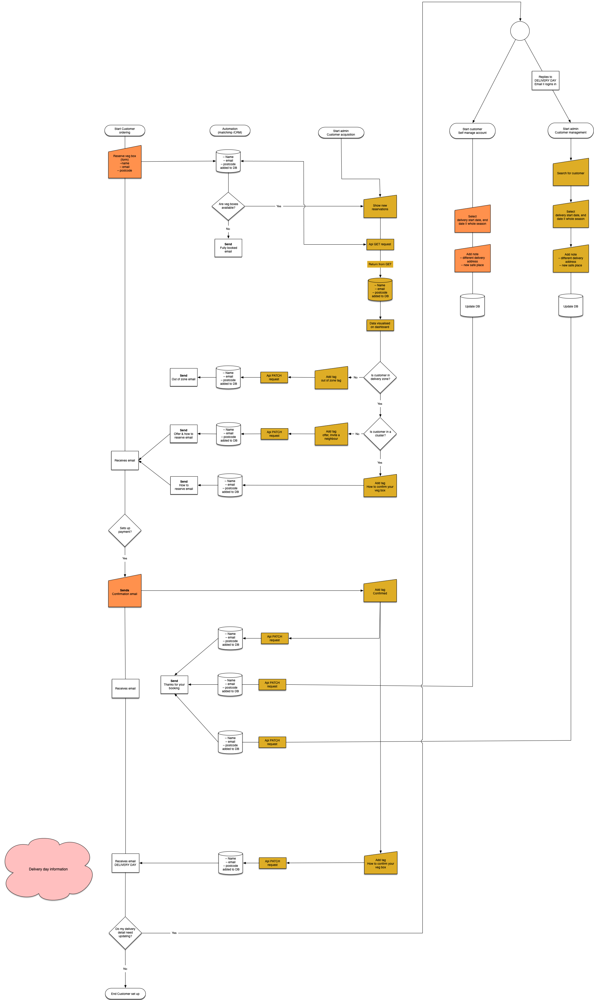
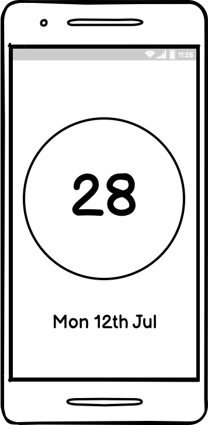
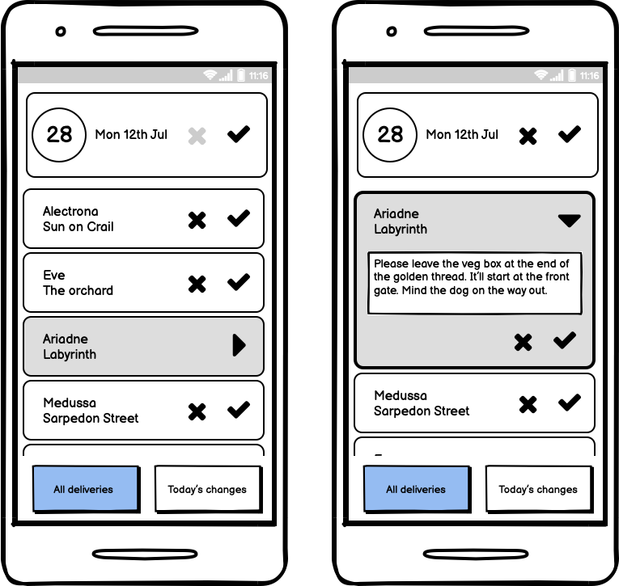
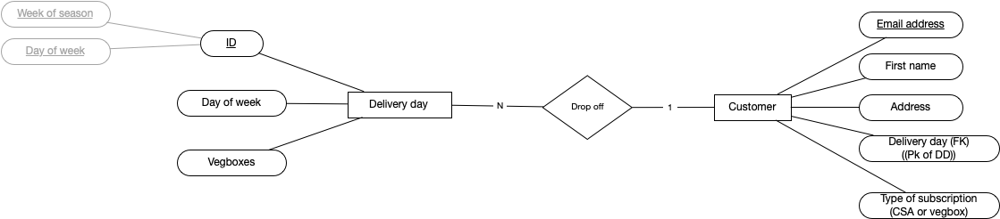

#Small farm 

## Bief

### ~Gym~ Farm

A local ~gym~ farm has asked you to build a piece of software to help them to manage ~memberships~ vegbox subscriptions, and register ~members for~ customers to ~classes~ deliveries.

#### MVP

- The app should allow the ~gym~ farm to create and edit Customers
- The app should allow the ~gym~ farm to create and edit Deliveries
- The app should allow the ~gym~ farm to book ~members~ customers on specific ~classes~ deliveries
- The app should show a list of ~all upcoming classes~ any changes to regular deliveries
- The app should show all ~members~ customers that are booked ~in for a particular class~ on to a particular delivery

#### Inspired By

[Glofox](https://www.glofox.com/club-solution/), [Pike13](https://www.pike13.com/pike13-scheduling-software-demo)
[Bandcamp](https://bandcamp.com)

#### Possible Extensions

- ~Classes~ Deliveries could have a maximum capacity, and ~users~ customers can only be added while there is space remaining.
- The ~gym~ could be able to give its ~members~ customers Premium or Standard membership. ~Standard members can only be signed up for classes during off-peak hours.~
- The ~Gym~ could mark members and classes as active/deactivated. Deactivated members/classes will not appear when creating bookings. 
– Customers could add notes to their account

#### Why a farm?
At the start of lockdown this year a small farm contacted me to help them pivot their business model. They switched from selling produce at the farmers market to vegbox deliveries.

With a simple sign up page and £20 worth of Facebook advertising I was able to generate £6'000 of sales in 10 days. Saving the season.

From there I managed customers payment processes and delivery routes, liasing with the farmer, customer and driver throughout. This was a lot of manual work which involved jumping between google maps, whats app, emails csv etc. It relied heavily on my technical expertise which in ususal circumstances is very costly. A dashboard to manage customers and customer acquisition is the sensible replacement.

I know the business intimately and have the data to build a number of informed personas.

###### The bigger picture
With covid the consumer became aware of food scarcity. Brext and environmental change could exacabate this. During lockdown customers and supermarkets alike turned to local producers and suppliers. There a clear gap in the market for software/serice which would allow small scale producers and suppliers to easily manage their customers.

## Planning

## Wireframes

## Farm data requirements

The farm makes money by selling seasonal subscriptions of veg boxes which it delivers to its customers

The farm has seasons

A season has weeks of the year

A veg box subscription exists for a season

A customer buys a veg box subscription

A veg box is delivered weekly for the whole of the season

A customer has a delivery day

A customer might make a change to their delivery information

A customer’s delivery day could change, on occasion.

Each customer has a name, address, email address

A delivery day has many drop offs each day, a drop off has one delivery day

A drop off has a delivery day and an address 

